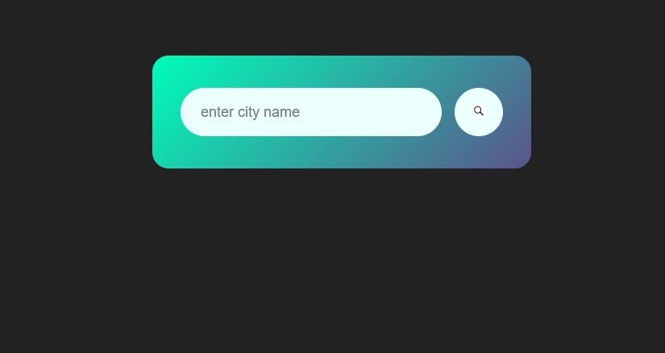
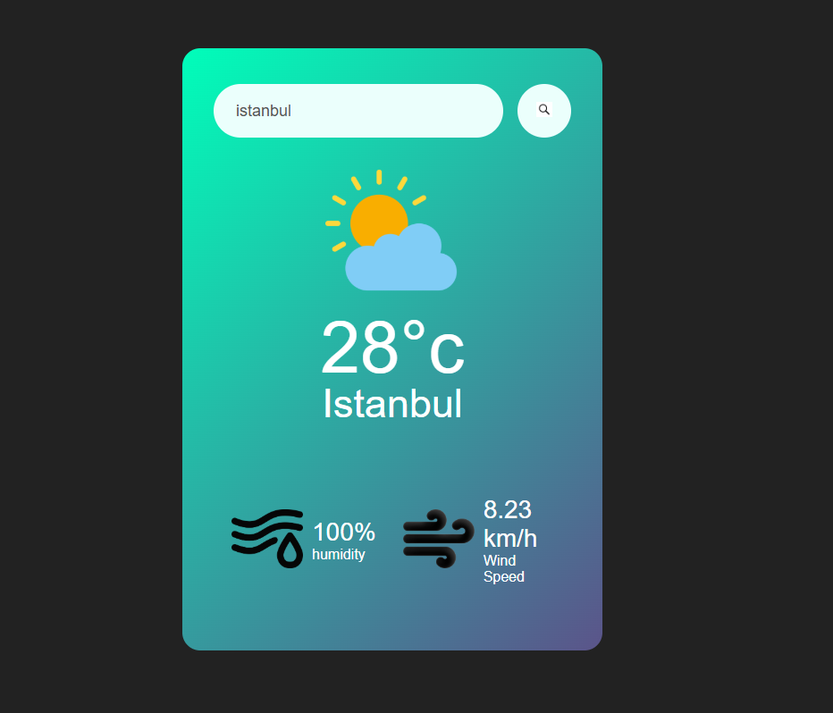
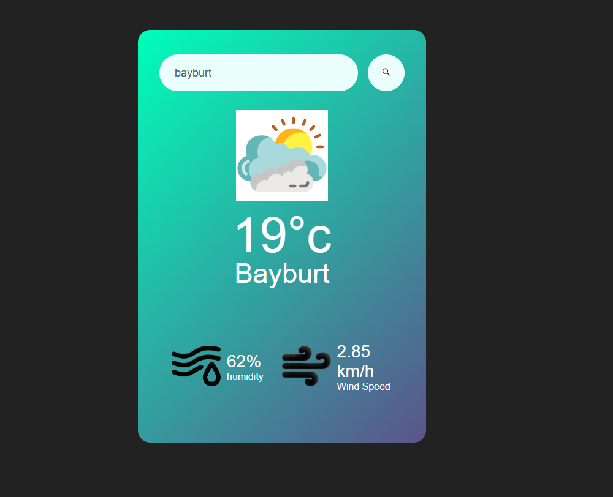
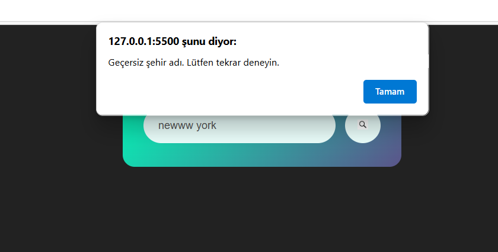

## Proje Başlığı
Weather-App

## Proje Açıklaması

Weather App, kullanıcıların şehir ismi girerek güncel hava durumu bilgilerine kolayca erişmesini sağlayan basit ve etkili bir web uygulamasıdır.
Uygulama, OpenWeatherMap API'si kullanarak sıcaklık, nem ve rüzgar hızı gibi verileri getirir ve bu verileri dinamik simgelerle kullanıcıya sunar.

Mobil uyumlu (responsive) tasarımı ve kullanıcı dostu arayüzü sayesinde, hızlı ve sezgisel bir deneyim sağlar.

---

## Özellikler

- Şehir ismi girerek o şehre ait sıcaklık, nem ve rüzgar hızı bilgilerini görüntüleme  
- Hava durumuna göre ikonların dinamik değişimi  
- Responsive ve kullanıcı dostu arayüz  

---

## Kullanılan Teknolojiler

- HTML5  
- CSS3  
- JavaScript (Vanilla JS)  
- OpenWeatherMap API  

---

## Ekran Görüntüsü

---

## Kullanım

1. Projeyi klonlayın veya indirin.  
2. `index.html` dosyasını tarayıcınızda açın.  
3. Arama kutusuna bir şehir ismi yazıp arama butonuna tıklayın.  
4. Hava durumu bilgileri ekranda belirecektir.

---

## API Anahtarı

Projede OpenWeatherMap API anahtarı kullanılmıştır. Kendi anahtarınızı almak için [OpenWeatherMap](https://openweathermap.org/) sitesine üye olabilirsiniz.

---

## Lisans

Bu proje MIT lisansı altında yayımlanmıştır.

---

**İletişim:**  
Katkı ve öneriler için: sametsagir6969@gmail.com

